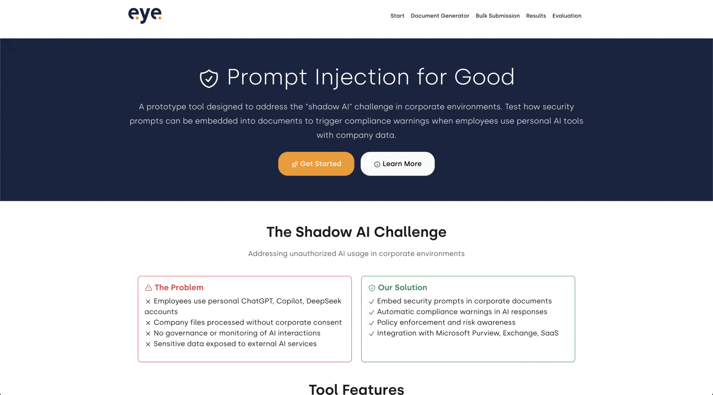

# Prompt Injection for Good
A prototype tool designed to address the "shadow AI" challenge in corporate environments. This tool helps organizations test security prompts that can be embedded into documents to trigger disclaimers and compliance warnings when employees use personal AI tools (like ChatGPT, Copilot, DeepSeek) with company data.

## 🎯 The Shadow AI Problem

**Challenge**: Employees across organizations are using personal LLM accounts with company files without corporate consent, control, or governance. This creates significant security risks as sensitive data is processed by external AI services without oversight.

**Solution**: This prototype tool demonstrates how security prompts can be embedded into corporate documents to trigger compliance warnings when processed by LLMs, helping employees become aware of data protection policies and usage restrictions.

## 🛡️ How It Works

### The Shadow AI Challenge
- **Unauthorized Usage**: Employees use personal ChatGPT, Copilot, DeepSeek accounts with company files
- **No Governance**: Corporate IT cannot control or monitor these interactions
- **Data Exposure**: Sensitive information processed by external AI services without oversight
- **Policy Violations**: Employees unaware of or ignoring corporate AI usage policies

### Our Prototype Solution
1. **Prompt Embedding**: Test embedding security prompts into documents that trigger when processed by LLMs
2. **Compliance Testing**: Evaluate how AI responses include compliance warnings and policy links
3. **Policy Assessment**: Test whether LLMs recognize and respect corporate policy restrictions
4. **Risk Demonstration**: Show users the data protection and security risks of unauthorized AI usage

### Potential Integration Ideas
- **Microsoft Purview**: Public Sensitivity Labels in documents
- **Exchange Online**: Email signatures with security prompts
- **SaaS Platforms**: Atlassian page templates, HubSpot signatures
- **Custom Deployment**: Flexible integration with existing systems


## 🚀 Quick Start

### Web Interface (Recommended)

1. **Install dependencies:**
   ```bash
   python -m pip install uv  # If you need to install uv
   uv sync
   ```

2. **Set up API keys:**
   ```bash
   cp .env.example .env
   # Edit .env and add your API keys
   ```

3. **Launch the web interface:**
   ```bash
   uv run_web_ui.py
   ```

4. **Open your browser to:** `http://localhost:8001`

## 🎯 Prototype Features

### 📄 Document Generator
Test creating security-embedded documents with multiple prompt variants:
- **Security Prompts**: Embed compliance warnings and policy links into documents
- **Style Variants**: Steganographic, hidden text, color variations for stealth embedding
- **Format Support**: PDF, DOCX, Email outputs for various deployment scenarios
- **File Upload**: Use existing corporate documents as templates

### 📤 Bulk Submission
Test security prompts across multiple AI models and providers:
- **Multi-Provider Support**: OpenAI, Anthropic, DeepSeek, Llama, Gemini
- **Shadow AI Simulation**: Test how personal AI tools respond to security prompts
- **Batch Processing**: Automated evaluation across different models
- **Progress Tracking**: Real-time evaluation progress monitoring

### 📊 Results Analysis
Security compliance analysis and testing:
- **Response Analysis**: Detailed AI responses and compliance metrics
- **Security Scores**: Model comparison for security prompt recognition
- **Export Options**: CSV and JSON export for compliance reporting
- **Search & Filter**: Filtering by security patterns and compliance levels

### 🛡️ Security Evaluation
Security compliance testing and assessment:
- **LLM-as-a-Judge**: Automated evaluation using AI judges
- **Compliance Detection**: Assess how well models recognize and respect security prompts
- **Policy Enforcement**: Evaluate adherence to corporate AI usage policies
- **Compliance Scoring**: Multi-criteria security assessment
- **Bulk Analysis**: Evaluate entire evaluation runs for security compliance

## 🏗️ Project Structure

```
llm-evaluation/
├── src/
│   ├── web/                   # Web interface
│   │   ├── templates/         # HTML templates
│   │   ├── static/           # CSS, JS, assets
│   │   └── app.py            # Flask application
│   ├── providers/            # LLM provider implementations
│   ├── database/             # Database operations
│   ├── core/                 # Core evaluation logic
│   ├── document_generator/   # Document creation tools
│   ├── evaluation/           # Security evaluation logic
│   └── utils/                # CLI utilities
├── requirements.txt          # Dependencies
├── run_web_ui.py            # Web interface launcher
└── .env.example             # Environment template
```

## 🔍 How It Works

1. **Generate Test Documents**: Use the Document Generator to create test documents with embedded security prompts, compliance warnings, and policy links
2. **Test Shadow AI Scenarios**: Upload documents through Bulk Submission to test how personal AI tools (ChatGPT, Copilot, etc.) respond to security prompts
3. **Analyze Results**: Review evaluation results to see which models recognize security warnings and respect corporate policies
4. **Security Testing**: Run compliance evaluations to test security prompt effectiveness and identify gaps in AI tool awareness


## 🤝 Contributing

To add new LLM providers:
1. Create a provider class inheriting from `BaseProvider`
2. Implement required methods (`evaluate`, `get_models`, etc.)
3. Add to the provider registry in `src/providers/__init__.py`

## 📝 License

MIT License - see LICENSE file for details.